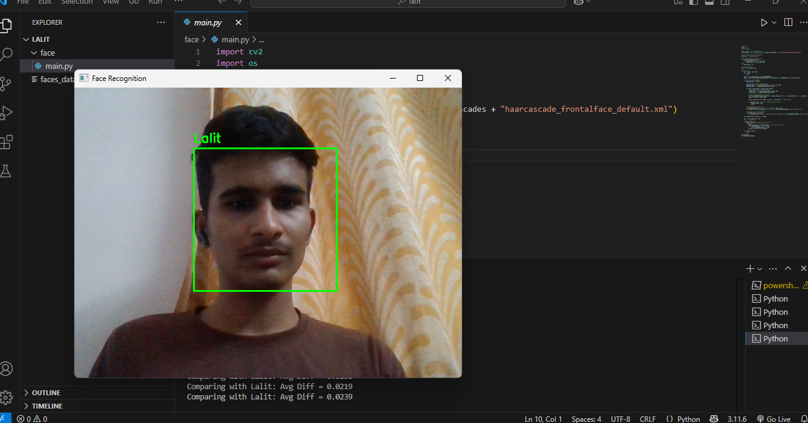

# Simple Face Recognition System using OpenCV

This project is a basic real-time face recognition system built using Python and OpenCV.

## Features

- Detects faces in real-time from webcam feed.
- Recognizes previously saved faces based on pixel difference.
- Allows saving new faces with a custom name.
- Stores and loads known faces using `pickle`.

## 📁 Project Structure

```
FaceRecognitionApp/
│
├── main.py                 # Main face recognition script
├── faces_data.pkl          # Stored face data (auto-created)
└── README.md               # Project documentation
```
## 📸 Screenshot

Here’s how the face recognition system looks in action:


---

## 🧪 Technologies Used

| Technology | Description |
|------------|-------------|
| Python     | Core language for development |
| OpenCV     | For face detection and image processing |
| Haar Cascade | Pre-trained face detector used for real-time detection |
| Pickle     | Python module used to store/load face data persistently |

---
